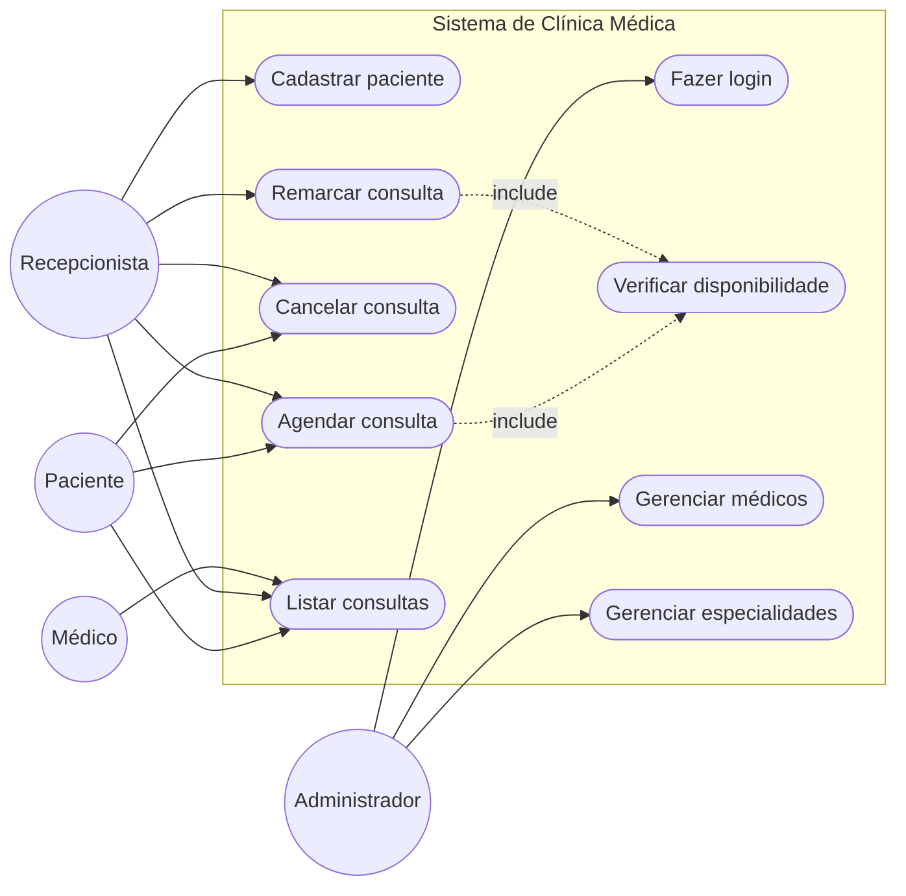

# Diagrama de Casos de Uso

```mermaid
graph LR
    Paciente((Paciente))
    Recepcionista((Recepcionista))
    Medico((Médico))
    Admin((Administrador))

    subgraph Sistema[Sistema de Clínica Médica]
        UC1([Fazer login])
        UC2([Cadastrar paciente])
        UC3([Agendar consulta])
        UC4([Verificar disponibilidade])
        UC5([Cancelar consulta])
        UC6([Remarcar consulta])
        UC7([Listar consultas])
        UC8([Gerenciar médicos])
        UC9([Gerenciar especialidades])
    end

    Paciente --> UC3
    Paciente --> UC5
    Paciente --> UC7

    Recepcionista --> UC2
    Recepcionista --> UC3
    Recepcionista --> UC5
    Recepcionista --> UC6
    Recepcionista --> UC7

    Medico --> UC7

    Admin --> UC1
    Admin --> UC8
    Admin --> UC9

    UC3 -. include .-> UC4
    UC6 -. include .-> UC4
```

> O agendamento (UC3) e a remarcação (UC6) sempre incluem a verificação
> de disponibilidade (UC4), por isso o relacionamento «include».
