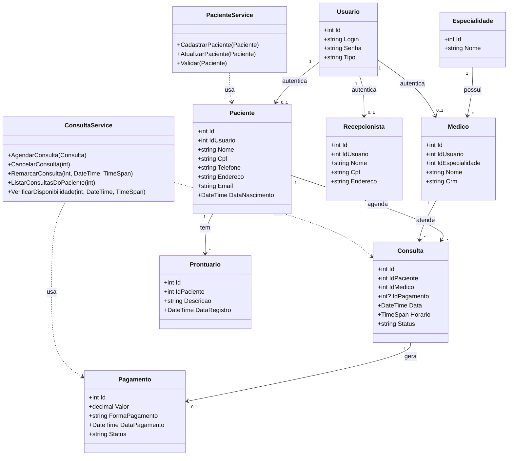

# Diagrama de Classes

```mermaid
classDiagram
    class Usuario {
        +int Id
        +string Login
        +string Senha
        +string Tipo
    }
    class Paciente {
        +int Id
        +int IdUsuario
        +string Nome
        +string Cpf
        +string Telefone
        +string Endereco
        +string Email
        +DateTime DataNascimento
    }
    class Medico {
        +int Id
        +int IdUsuario
        +int IdEspecialidade
        +string Nome
        +string Crm
    }
    class Especialidade {
        +int Id
        +string Nome
    }
    class Consulta {
        +int Id
        +int IdPaciente
        +int IdMedico
        +int? IdPagamento
        +DateTime Data
        +TimeSpan Horario
        +string Status
    }
    class Pagamento {
        +int Id
        +decimal Valor
        +string FormaPagamento
        +DateTime DataPagamento
        +string Status
    }
    class Recepcionista {
        +int Id
        +int IdUsuario
        +string Nome
        +string Cpf
        +string Endereco
    }
    class Prontuario {
        +int Id
        +int IdPaciente
        +string Descricao
        +DateTime DataRegistro
    }

    class ConsultaService {
        +AgendarConsulta(Consulta)
        +CancelarConsulta(int)
        +RemarcarConsulta(int, DateTime, TimeSpan)
        +ListarConsultasDoPaciente(int)
        +VerificarDisponibilidade(int, DateTime, TimeSpan)
    }
    class PacienteService {
        +CadastrarPaciente(Paciente)
        +AtualizarPaciente(Paciente)
        +Validar(Paciente)
    }

    Especialidade "1" --> "*" Medico : possui
    Paciente "1" --> "*" Consulta : agenda
    Medico "1" --> "*" Consulta : atende
    Consulta "1" --> "0..1" Pagamento : gera
    Paciente "1" --> "*" Prontuario : tem
    Usuario "1" --> "0..1" Paciente : autentica
    Usuario "1" --> "0..1" Medico : autentica
    Usuario "1" --> "0..1" Recepcionista : autentica

    ConsultaService ..> Consulta : usa
    ConsultaService ..> Pagamento : usa
    PacienteService ..> Paciente : usa
```
