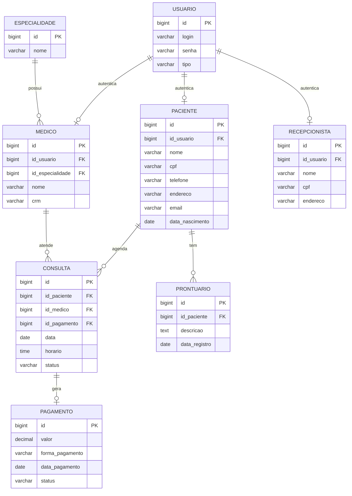

# Diagrama Entidade-Relacionamento (ER)

```mermaid
erDiagram
    USUARIO ||--o| PACIENTE : "autentica"
    USUARIO ||--o| MEDICO : "autentica"
    USUARIO ||--o| RECEPCIONISTA : "autentica"
    ESPECIALIDADE ||--o{ MEDICO : "possui"
    PACIENTE ||--o{ CONSULTA : "agenda"
    MEDICO ||--o{ CONSULTA : "atende"
    CONSULTA ||--o| PAGAMENTO : "gera"
    PACIENTE ||--o{ PRONTUARIO : "tem"

    USUARIO {
        bigint id PK
        varchar login
        varchar senha
        varchar tipo
    }
    PACIENTE {
        bigint id PK
        bigint id_usuario FK
        varchar nome
        varchar cpf
        varchar telefone
        varchar endereco
        varchar email
        date data_nascimento
    }
    RECEPCIONISTA {
        bigint id PK
        bigint id_usuario FK
        varchar nome
        varchar cpf
        varchar endereco
    }
    MEDICO {
        bigint id PK
        bigint id_usuario FK
        bigint id_especialidade FK
        varchar nome
        varchar crm
    }
    ESPECIALIDADE {
        bigint id PK
        varchar nome
    }
    CONSULTA {
        bigint id PK
        bigint id_paciente FK
        bigint id_medico FK
        bigint id_pagamento FK
        date data
        time horario
        varchar status
    }
    PAGAMENTO {
        bigint id PK
        decimal valor
        varchar forma_pagamento
        date data_pagamento
        varchar status
    }
    PRONTUARIO {
        bigint id PK
        bigint id_paciente FK
        text descricao
        date data_registro
    }
```
